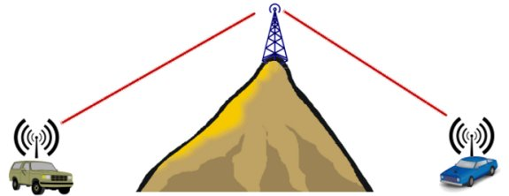

# JsonTalkie - Walkie-Talkie based Communication for Arduino

A lightweight library for Arduino communication and control using JSON messages over network sockets, with Python companion scripts for host computer interaction.

## Features

- Bi-directional Walkie-Talkie based communication between Arduino and Python
- Simple command/response pattern with "Walkie-talkie" style interaction
- Talker configuration with a Manifesto for self-describing capabilities
- Automatic command discovery and documentation
- Support for multiple devices on the same network

## Installation

### Arduino Library
1. **Using Arduino Library Manager**:
   - Open Arduino IDE
   - Go to `Sketch > Include Library > Manage Libraries`
   - Search for "JsonTalkie"
   - Click "Install"

2. **Manual Installation**:
   - Download the latest release from GitHub
   - Extract to your Arduino libraries folder
   - Restart Arduino IDE

## Python Command Line
### JsonTalkiePy repository with command line as Talker
   - Talker in [JsonTalkiePy](https://github.com/ruiseixasm/JsonTalkiePy)
   - Got the the page above for more details concerning its usage

### Typical usage
```
>>> talk
        [talk spy]                 I'm a Spy and I spy the talkers' pings
        [talk test]                I test the JsonMessage class
        [talk blue]                I turn led Blue on and off
        [talk nano]                Arduino Nano
        [talk mega]                I'm a Mega talker
        [talk uno]                 Arduino Uno
        [talk green]               I'm a green talker
        [talk buzzer]              I'm a buzzer that buzzes
>>> list nano
        [call nano 0|buzz]         Buzz for a while
        [call nano 1|ms]           Gets and sets the buzzing duration
>>> call nano 0
        [call nano 0]              roger
>>> ping nano
        [ping nano]                3
>>> system nano board
        [system nano board]        Arduino Uno/Nano (ATmega328P)
>>> system nano socket
        [system nano socket]       0       BroadcastSocket_EtherCard
>>> system nano manifesto
        [system nano manifesto]    BlackManifesto
>>> list test
        [call test 0|all]          Tests all methods
        [call test 1|deserialize]          Test deserialize (fill up)
        [call test 2|compare]      Test if it's the same
        [call test 3|has]          Test if it finds the given char
        [call test 4|has_not]      Test if DOESN't find the given char
        [call test 5|length]       Test it has the right length
        [call test 6|type]         Test the type of value
        [call test 7|validate]     Validate message fields
        [call test 8|identity]     Extract the message identity
        [call test 9|value]        Checks if it has a value 0
        [call test 10|message]     Gets the message number
        [call test 11|from]        Gets the from name string
        [call test 12|remove]      Removes a given field
        [call test 13|set]         Sets a given field
        [call test 14|edge]        Tests edge cases
        [call test 15|copy]        Tests the copy constructor
        [call test 16|string]      Checks if it has a value 0 as string
>>> call test 0
        [call test 0]              roger
>>> exit
	Exiting...
```

## JsonTalkie architecture
## Description
The center class is the `MessageRepeater` class, this class routes the JsonMessage between Uplinked
Talkers and Sockets and Downlinked Talkers and Sockets.
## Repeater diagram


The Repeater works in similar fashion as an HAM radio repeater on the top of a mountain, with a clear distinction of Uplinked and Downlinked communications, where the Uplinked nodes are considered remote nodes and the downlinked nodes are considered local nodes.
```
+-------------------------+      +-------------------------+
| Uplinked Sockets (node) |      | Uplinked Talkers (node) |
+-------------------------+      +-------------------------+
                        |          |
                    +------------------+
                    | Message Repeater |
                    +------------------+
                        |          |
+---------------------------+  +---------------------------+
| Downlinked Sockets (node) |  | Downlinked Talkers (node) |
+---------------------------+  +---------------------------+
```

## Talker diagram
```
+--------+
| Talker |
+--------+
       |
     +-----------+
     | Manifesto |
     +-----------+
```

## Message protocol
The extensive list of all Values is in the structure `TalkieCodes`.
### Message Value
These are the Message Values (commands):
- **noise** - Invalid, missing or malformed data
- **talk** - Lists existent talkers in the network
- **channel** - Channel management/configuration
- **ping** - Network presence check and latency
- **call** - Action Talker invocation
- **list** - Lists Talker actions
- **system** - System control/status messages
- **echo** - Messages Echo returns
- **error** - Error notification

### Broadcast Value
Local messages aren't send to uplinked Sockets, except if they are up bridged.
- **none** - No broadcast, the message is dropped
- **remote** - Broadcast to remote talkers
- **local** - Broadcast within local network talkers
- **self** - Broadcast to self only (loopback)

### System Value
This messages are exclusive to the system.
- **undefined** - Unspecified system request
- **board** - Board/system information request
- **mute** - Returns or sets the mute mode
- **drops** - Packet loss statistics
- **delay** - Network delay configuration
- **socket** - List Socket class names
- **manifesto** - Show the Manifesto class name

The `mute` setting is exclusive to the `call` commands in order to reduce network overhead.

### Repeater Rules
The `MessageRepeater` routes the messages accordingly to its source and message value, the source
comes from the call method `_transmitToRepeater` depending if it's a Socket or a Talker, both here called
nodes.
1. All `remote` messages from `up_linked` *and* `up_bridged` Sockets are routed to `down_linked` nodes (2 to 2);
1. All `remote` messages from `down_linked` nodes are routed to the `up_linked` *and* `up_bridged` Sockets (2 to 2);
1. All `local` messages are routed to all nodes except the `up_linked` Sockets (4 to 4);
1. All `self` messages from a Talker are routed to that same Talker (1 to 1);
1. All `none` messages are dropped and thus NOT sent to any node (0 to 0).

In total there are the following 5 types of nodes:
1. `up_linked` Sockets;
1. `up_bridged` Sockets;
1. `down_linked` Sockets;
1. `down_linked` Talkers;
1. `up_linked` Talkers.

The rules above result in the following exclusions of message transmission:
- A Socket being `up_linked` means that it can NOT handle or transmit `local` messages.
- A Talker being `up_linked` means that it can NOT handle or transmit `remote` messages.

The setting of an `up_linked` Socket into an `up_bridged` one is useful for the situation where the
transmissions are done in the same platform considered local and thus it shall
bridge all `local` messages too.

The placement of a Talker as `up_linked` is intended to keep all its transmissions as local,
thus invisible to all remote Talkers.

## The Talker and its Manifesto
### Talker
These are the attributes of a Talker:
- **name** - The name by which a Talker is identified in the network and targeted with
- **description** - A brief description of the Talker returned in response to the `talk` command
- **channel** - A channel in order to be simultaneously target among other talkers
- **manifesto** - The Talker manifesto that sets all its Actions in detail

### Manifesto interface
In the folders [manifestos](https://github.com/ruiseixasm/JsonTalkie/tree/main/manifestos) you can find further description and some manifesto examples for diverse type of actions and Talker methods processing, like echo and error.

A Manifesto **implementation** has the following attributes:
- **calls** - An array of Actions (name and description)

An example of a calls array:
```cpp
Action calls[3] = {
	{"on", "Turns led ON"},
	{"off", "Turns led OFF"},
	{"actions", "Returns the number of triggered Actions"}
};
```
Besides the calls, a Manifesto implementation should also have these mandatory methods:
```cpp
const char* class_name() const override { return "BlueManifesto"; }
const Action* _getActionsArray() const override { return calls; }
uint8_t _actionsCount() const override { return sizeof(calls)/sizeof(Action); }
```
## The Broadcast Socket (interface)
A Broadcast Socket **implementation** shall be able to receive and send in broadcast mode, this ability is required because the Talkers are recognizable by their names shown by the `talk` command, and thus, become able to auto configure the following direct connections (unicast). The broadcast communications are mainly intended to discover talkers or send to a channel (many) instead of talker name (single).

### Implementation
In the folders [sockets](https://github.com/ruiseixasm/JsonTalkie/tree/main/sockets) you can find further description and many socket examples for diverse type of protocols and even libraries, like Ethernet and SPI protocols.

These are the member variables of the `BroadcastSocket`:
```cpp
	MessageRepeater* _message_repeater = nullptr;
	LinkType _link_type = LinkType::TALKIE_LT_NONE;

    // Pointer PRESERVE the polymorphism while objects don't!
    uint8_t _max_delay_ms = 5;
    bool _control_timing = false;
    uint16_t _last_local_time = 0;
    uint16_t _last_message_timestamp = 0;
    uint16_t _drops_count = 0;
```
And these are the methods which definition in the socket implementation is mandatory:
```cpp
virtual const char* class_name() const = 0;
virtual void _receive() = 0;
virtual bool _send(const JsonMessage& json_message) = 0;
```

## A bare minimum sketch with a Serial socket
This example is useful to illustrate how easy it is to include this library for a simple Serial socket.

### The .ino sketch for a Serial socket (115200)
```cpp
#include <JsonTalkie.hpp>
#include "SocketSerial.hpp"
#include "SerialManifesto.hpp"


const char talker_name[] = "serial";
const char talker_desc[] = "I'm a serial talker";
SerialManifesto serial_manifesto;
JsonTalker talker = JsonTalker(talker_name, talker_desc, &serial_manifesto);

// Singleton requires the & (to get a reference variable)
auto& serial_socket = SocketSerial::instance();

// SETTING THE REPEATER
BroadcastSocket* uplinked_sockets[] = { &serial_socket };
JsonTalker* downlinked_talkers[] = { &talker };
MessageRepeater message_repeater(
		uplinked_sockets, sizeof(uplinked_sockets)/sizeof(BroadcastSocket*),
		downlinked_talkers, sizeof(downlinked_talkers)/sizeof(JsonTalker*)
	);


void setup() {
    // Initialize pins FIRST before anything else
    pinMode(LED_BUILTIN, OUTPUT);
    digitalWrite(LED_BUILTIN, LOW); // Start with LED off

    // Then start Serial
    Serial.begin(115200);
    delay(250); // Important: Give time for serial to initialize
    Serial.println("\n\n=== Arduino with SERIAL ===");

    // Final startup indication
    digitalWrite(LED_BUILTIN, HIGH);
    delay(500);
    digitalWrite(LED_BUILTIN, LOW);

    Serial.println("Setup completed - Ready for JSON communication!");
}


void loop() {
    message_repeater.loop();
}
```
### The included manifesto and socket
The included manifesto and socket are in the folders [manifestos](https://github.com/ruiseixasm/JsonTalkie/tree/main/manifestos) and [sockets](https://github.com/ruiseixasm/JsonTalkie/tree/main/sockets) respectively, depending on the socket implemented being used, you may have more methods available specific for that socket.
### Interacting with the Talker
This example uses a Serial socket, so, the interaction is always one-to-one, and here you have two options, using another Talker with a different Manifesto that sends commands to this one, or just for testing, do it in an easier way with the [JsonTalkerPy](https://github.com/ruiseixasm/JsonTalkiePy) command line in the computer. To do so just follow the instructions [here](https://github.com/ruiseixasm/JsonTalkiePy).

### Command line usage
Type the following commands to start the Serial communication (change port if needed)
```sh
python talk.py --socket SERIAL --port COM5
```
Then you can just type commands
```
>>> talk
        [talk serial]              I'm a serial talker
>>> list serial
        [call serial 0|on]         Turns led ON
        [call serial 1|off]        Turns led OFF
>>> ping serial
        [ping serial]              15
>>> call serial on
        [call serial on]           roger
>>> call serial off
        [call serial off]          roger
>>> call serial off
        [call serial off]          negative        Already Off!
>>>
        Exiting...
```
## Use Cases
Besides the simple examples shown above, there are other interesting use cases that are important to consider.
### One platform, multiple boards
The JsonTalkie allows both **remote** and **local** communication depending on the type of linking.
By local communication one doesn't necessarily mean in the same board, it is possible to have local communication among multiple boards as long as they are in the same *platform*, so, you may have a circuit where different boards communicate with each other via protocols like the SPI.
```
+-----------------------------+                                     +-----------------------------+
| Ethernet socket (up linked) |                              +------| SPI socket (**up bridged**) |
+-----------------------------+                              |      +-----------------------------+
                          |                                  |                    |
                 +------------------+                        |           +------------------+
                 | Message Repeater |                        |           | Message Repeater |
                 +------------------+                        |           +------------------+
                    |           |                            |                    |
+-----------------------+  +--------------------------+      |         +-----------------------+
| Talkers (down linked) |  | SPI Socket (down linked) |------+         | Talkers (down linked) |
+-----------------------+  +--------------------------+                +-----------------------+

+-----------------------------------------------------+             +-----------------------------+
|                   ESP32 Board                       |             |        Arduino nano         |
+-----------------------------------------------------+             +-----------------------------+
+-------------------------------------------------------------------------------------------------+
|                                    Local platform with two boards                               |
+-------------------------------------------------------------------------------------------------+
```
In the scheme above, the Arduino nano board has its SPI Socket configured as *bridged*, this means
that not only remote messages are sent trough it, buy *also*, local messages. The SPI Socket in
the ESP32 board is a down linked one, this means it behaves like a down linked Talker, sending both
remote and local messages to its Repeater. This way, the SPI link between both SPI Sockets carries
both remote and local messages, like a bridge.

The Repeater automatically sets the up linked sockets as up linked, so, in order to turn an up linked socket into a bridged one, you need to set it in the `setup` function like so:
```cpp
    spi_socket.bridgeSocket();  // Now accepts LOCAL messages too
```
With the command `system` it's possible to get the board and the sockets associated to each Talker.
```
>>> talk
	[talk spy]           	   I'm a Spy and I spy the talkers' pings
	[talk test]          	   I test the JsonMessage class
	[talk blue]          	   I turn led Blue on and off
	[talk green]         	   I'm a green talker
	[talk buzzer]        	   I'm a buzzer that buzzes
>>> system blue board
	[system blue board]  	   ESP32 (Rev: 100)
>>> system green board
	[system green board] 	   Arduino Uno/Nano (ATmega328P)
>>> system blue socket
	[system blue socket] 	   0	   Changed_EthernetENC
	[system blue socket] 	   1	   SPI_ESP_Arduino_Master
>>> system green socket
	[system green socket]	   0	   SPI_Arduino_Slave
>>>
```
Note that you can have more than two boards, given that the SPI protocol allows more than a single
connection.
### Unit testing
One difficulty in dealing with embedded development, is the ability of testing and debugging single methods,
this can be easily accomplished with the JsonTalkie. You can create a Manifesto that does just that.

Bellow is an example of a series of unit tests done to the class `JsonMessage` during its development.
```
>>> talk test
	[talk test]          	   I test the JsonMessage class
>>> list test
	[call test 0|all]    	   Tests all methods
	[call test 1|deserialize]	   Test deserialize (fill up)
	[call test 2|compare]	   Test if it's the same
	[call test 3|has]    	   Test if it finds the given char
	[call test 4|has_not]	   Test if DOESN't find the given char
	[call test 5|length] 	   Test it has the right length
	[call test 6|type]   	   Test the type of value
	[call test 7|identity]	   Extract the message identity
	[call test 8|value]  	   Checks if it has a value 0
	[call test 9|message]	   Gets the message number
	[call test 10|from]  	   Gets the from name string
	[call test 11|remove]	   Removes a given field
	[call test 12|set]   	   Sets a given field
	[call test 13|edge]  	   Tests edge cases
	[call test 14|copy]  	   Tests the copy constructor
	[call test 15|string]	   Checks if it has a value 0 as string
>>> call test edge
	[call test edge]     	   roger
>>> call test 0
	[call test 0]        	   roger
>>>
```
In the example above, specific edge cases are tested, the *roger* return means that the test passed, otherwise
the return value would be *negative*. It is also possible to run all tests at once, with roger meaning all
have passed. You can find the *test* Manifesto in the [manifestos folder](https://github.com/ruiseixasm/JsonTalkie/tree/main/manifestos).
### Inside calls
So far we have been doing remote calls from a computer via Python, but there are cases that would be useful
to do a call from inside the board's Talker itself. This is the case of the *spy* manifesto.
```
>>> talk spy
	[talk spy]           	   I'm a Spy and I spy the talkers' pings
>>> list spy
	[call spy 0|ping]    	   I ping every talker, also by name or channel
	[call spy 1|ping_self]	   I can even ping myself
	[call spy 2|call]    	   Able to do [<talker> <action>]
>>> call spy 0 blue
	[call spy 0]         	   roger	   1	   blue
>>> call spy 0 green
	[call spy 0]         	   roger	   4	   green
>>> ping blue
	[ping blue]          	   3
>>> ping green
	[ping green]         	   8
>>>
```
In the interaction above, we have the ping results, from inside the ESP32 board (spy Talker), 1 and 4 milliseconds respectively.
From the computer those results are greater because they reflect the wi-fi latency too. Note that the latency values above include
the return time, so, in reality, it takes around half those values to reach the Talker.

Nevertheless, with the help of the spy, we can see that the SPI connections represents an increase of 3 milliseconds in latency (4 - 1).
### Talker as Caller
So far the calls were made via Python command line with [JsonTalkiePy](https://github.com/ruiseixasm/JsonTalkiePy), but a device can be a caller too.
Most of the time the [JsonTalkiePy](https://github.com/ruiseixasm/JsonTalkiePy) is used to configure Arduino talkers and not to act on themselves directly,
like in this example, the talker *caller* is activated and then set with the current minutes. Then is up to the *caller* to call the *nano* talker
and on the action *buzz*. This is done once as it follows.
```
>>> talk caller
        [talk caller]              I'm a 60 minutes buzzer caller
>>> list caller
        [call caller 0|active]     Gets or sets the active status
        [call caller 1|minutes]    Gets or sets the actual minutes
>>> call caller 0
        [call caller 0]            roger           0
>>> call caller 0 1
        [call caller 0]            roger           1
>>> call caller 1
        [call caller 1]            roger           58
>>> call caller 1 3
        [call caller 1]            roger           3
>>>
```
After this, the *caller* has its minutes synced with the actual minutes and will call the *buzz* of the *nano* each hour.
In the example bellow, named *TalkieEthernet*, that you can find in the [examples](https://github.com/ruiseixasm/JsonTalkie/tree/main/examples) folder,
it is used the manifesto *CallerManifesto*, that you can find in the [manifestos](https://github.com/ruiseixasm/JsonTalkie/tree/main/manifestos) folder, is as follows.
```cpp
#ifndef CALLER_MANIFESTO_HPP
#define CALLER_MANIFESTO_HPP

#include <TalkerManifesto.hpp>


class CallerManifesto : public TalkerManifesto {
public:

    const char* class_name() const override { return "CallerManifesto"; }

    CallerManifesto() : TalkerManifesto() {
		pinMode(LED_BUILTIN, OUTPUT);
		digitalWrite(LED_BUILTIN, LOW); // Start with LED off
	}	// Constructor


protected:

	bool _active_caller = false;
	uint32_t _time_to_call = 0;
	uint32_t _time_to_live = 0;

    Action calls[2] = {
		{"active", "Gets or sets the active status"},
		{"minutes", "Gets or sets the actual minutes"}
    };
    
public:
    
    const Action* _getActionsArray() const override { return calls; }

    // Size methods
    uint8_t _actionsCount() const override { return sizeof(calls)/sizeof(Action); }


    // Index-based operations (simplified examples)
    bool _actionByIndex(uint8_t index, JsonTalker& talker, JsonMessage& json_message, TalkerMatch talker_match) override {
        (void)talker;		// Silence unused parameter warning
        (void)talker_match;	// Silence unused parameter warning
		
		if (index >= sizeof(calls)/sizeof(Action)) return false;
		
		// Actual implementation would do something based on index
		switch(index) {

			case 0:
			{
				if (json_message.has_nth_value_number(0)) {
					if (json_message.get_nth_value_number(0)) {
						if (_active_caller) {
							json_message.set_nth_value_string(0, "Already active!");
						} else {
							_active_caller = true;
							return true;
						}
					} else {
						if (!_active_caller) {
							json_message.set_nth_value_string(0, "Already inactive!");
						} else {
							_active_caller = false;
							return true;
						}
					}
				} else {
					return json_message.set_nth_value_number(0, (uint32_t)_active_caller);
				}
			}
			break;

			case 1:
			{
				uint32_t present_time = millis();
				if (json_message.has_nth_value_number(0)) {
					uint32_t milliseconds_to_call = json_message.get_nth_value_number(0) % 60;
					milliseconds_to_call = (60UL - milliseconds_to_call) * 60 * 1000;
					_time_to_call = present_time + milliseconds_to_call;
					return true;
				} else {
					uint32_t minutes = (_time_to_call - present_time) / 1000 / 60;
					minutes = 59UL - minutes % 60;	// 0 based (0 to 59 minutes)
					return json_message.set_nth_value_number(0, minutes);
				}
			}
			break;
		}
		return false;
	}


	void _loop(JsonTalker& talker) override {
		uint32_t present_time = millis();
		if ((int32_t)(present_time - _time_to_call) >= 0) {
			if (_active_caller) {
				JsonMessage call_buzzer;
				call_buzzer.set_message_value(MessageValue::TALKIE_MSG_CALL);
				call_buzzer.set_broadcast_value(BroadcastValue::TALKIE_BC_REMOTE);
				call_buzzer.set_to_name("nano");
				call_buzzer.set_action_name("buzz");
				talker.transmitToRepeater(call_buzzer);
			}
			// The time needs to be updated regardless of the transmission above
			_time_to_call = present_time + 60UL * 60 * 1000;	// 60 minutes
		}
		if ((int32_t)(present_time - _time_to_live) >= 0) {
			digitalWrite(LED_BUILTIN, LOW);
			_time_to_live = present_time + 61UL * 60 * 1000;	// 61 minutes
		}
	}


	void _echo(JsonTalker& talker, JsonMessage& json_message, TalkerMatch talker_match) override {
        (void)talker;		// Silence unused parameter warning
        (void)json_message;	// Silence unused parameter warning
        (void)talker_match;	// Silence unused parameter warning

		uint32_t present_time = millis();
		_time_to_live = present_time + 61UL * 60 * 1000;	// 61 minutes
		digitalWrite(LED_BUILTIN, HIGH);
    }
    
};


#endif // CALLER_MANIFESTO_HPP
```
This manifesto calls the *nano* Talker to trigger the action *buzz*, this command is directly done between two Arduino boards
without any computer evolvement. The calling is done inside the `_loop` method as such:
```cpp
			if (_active_caller) {
				JsonMessage call_buzzer;
				call_buzzer.set_message_value(MessageValue::TALKIE_MSG_CALL);
				call_buzzer.set_broadcast_value(BroadcastValue::TALKIE_BC_REMOTE);
				call_buzzer.set_to_name("nano");
				call_buzzer.set_action_name("buzz");
				talker.transmitToRepeater(call_buzzer);
			}
```

The *nano* talker is also in the [examples](https://github.com/ruiseixasm/JsonTalkie/tree/main/examples) folder
in the example *TalkieEtherCard* that contains the manifesto *BlackManifesto* that can also be found in the
[manifestos](https://github.com/ruiseixasm/JsonTalkie/tree/main/manifestos) folder and is as follows.
```cpp
#ifndef BLACK_MANIFESTO_HPP
#define BLACK_MANIFESTO_HPP

#include <TalkerManifesto.hpp>

#define BUZZ_PIN 3	// External BLACK BOX pin


class BlackManifesto : public TalkerManifesto {
public:

    const char* class_name() const override { return "BlackManifesto"; }

    BlackManifesto() : TalkerManifesto() {}	// Constructor


protected:

    uint16_t _buzz_duration_ms = 100;
	uint16_t _buzz_start = 0;

	// ALWAYS MAKE SURE THE DIMENSIONS OF THE ARRAYS BELOW ARE THE CORRECT!

    Action calls[2] = {
		{"buzz", "Buzz for a while"},
		{"ms", "Gets and sets the buzzing duration"}
    };
    
public:

    const Action* _getActionsArray() const override { return calls; }

    // Size methods
    uint8_t _actionsCount() const override { return sizeof(calls)/sizeof(Action); }


	void _loop(JsonTalker& talker) override {
        (void)talker;		// Silence unused parameter warning
		if ((uint16_t)millis() - _buzz_start > _buzz_duration_ms) {
			#ifdef BUZZ_PIN
			digitalWrite(BUZZ_PIN, LOW);
			#endif
		}
	}

    
    // Index-based operations (simplified examples)
    bool _actionByIndex(uint8_t index, JsonTalker& talker, JsonMessage& json_message, TalkerMatch talker_match) override {
        (void)talker;		// Silence unused parameter warning
        (void)json_message;	// Silence unused parameter warning

		if (index < _actionsCount()) {
			// Actual implementation would do something based on index
			switch(index) {

				case 0:
				{
					digitalWrite(BUZZ_PIN, HIGH);
					_buzz_start = (uint16_t)millis();
					return true;
				}
				break;

				case 1:
					if (json_message.has_nth_value_number(0)) {
						_buzz_duration_ms = (uint16_t)json_message.get_nth_value_number(0);
					} else {
						json_message.set_nth_value_number(0, _buzz_duration_ms);
					}
					return true;
				break;
			}
		}
		return false;
	}
    

    void _echo(JsonTalker& talker, JsonMessage& json_message, TalkerMatch talker_match) override {
        (void)talker;		// Silence unused parameter warning
		
		char temp_string[TALKIE_MAX_LEN];
		json_message.get_from_name(temp_string, TALKIE_MAX_LEN);
		Serial.print( temp_string );
        Serial.print(" - ");
		ValueType value_type = json_message.get_nth_value_type(0);
		switch (value_type) {

			case ValueType::TALKIE_VT_STRING:
				json_message.get_nth_value_string(0, temp_string, TALKIE_MAX_LEN);
				Serial.println(temp_string);
			break;
			
			case ValueType::TALKIE_VT_INTEGER:
				Serial.println(json_message.get_nth_value_number(0));
			break;
			
			default:
            	Serial.println(F("Empty echo received!"));
			break;
		}
    }


    void _error(JsonTalker& talker, JsonMessage& json_message, TalkerMatch talker_match) override {
        (void)talker;		// Silence unused parameter warning
		
		char temp_string[TALKIE_MAX_LEN];
		json_message.get_from_name(temp_string, TALKIE_MAX_LEN);
		Serial.print( temp_string );
        Serial.print(" - ");
		ValueType value_type = json_message.get_nth_value_type(0);
		switch (value_type) {

			case ValueType::TALKIE_VT_STRING:
				json_message.get_nth_value_string(0, temp_string, TALKIE_MAX_LEN);
				Serial.println(temp_string);
			break;
			
			case ValueType::TALKIE_VT_INTEGER:
				Serial.println(json_message.get_nth_value_number(0));
			break;
			
			default:
            	Serial.println(F("Empty echo received!"));
			break;
		}
    }

};


#endif // BLACK_MANIFESTO_HPP
```

So, as expected, by being Walkie-Talkie alike, in JsonTalkie the communication is peer-to-peer and not necessarily centralized in a
commander device or computer.

